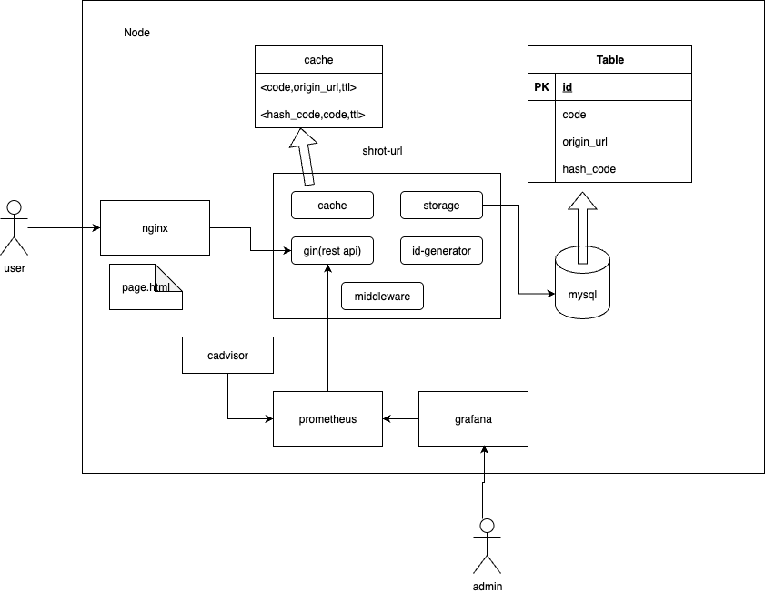

# go-shorturl
## 架构图

1. all service deployed within a machine using contaierization technology
2. nginx: a reverse proxy for short-url service & static page container
3. mysql: persistant storage for long_url and short_url mapping
4. short-url: service that provides short-url generation and redirect 
    * 4.1. cache(Local): accelerate redirect speed & avoid duplicate generate request for the same long-url frequently; can be replaced with a remote centralized cache(redis)
    * 4.2. storage: communicate with mysql using gorm framework
    * 4.3. gin: rest framework
    * 4.4. id-generator: use snow-flake lib to generate a unique num for each long-url
    * 4.5. middleware: collect metrics for prometheus to fetch
5. cadvisor: deploy per machine to collect container metrics for prometheus
6. prometheus & grafana: for service monitor use